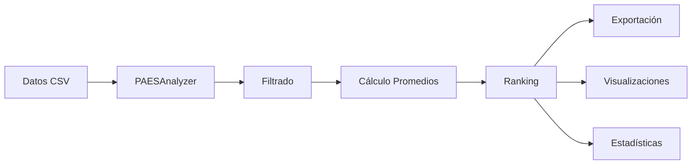

# 📊 PAES Ranking Chile - Resumen del Proyecto

## 🎯 Objetivo

Sistema profesional de análisis y ranking de resultados PAES (Prueba de Acceso a la Educación Superior) en Chile, que transforma notebooks exploratorios en una aplicación Python robusta, modular y lista para GitHub.

## 🏗️ Arquitectura del Proyecto

```
paes-ranking-chile/
│
├── 📁 src/                        # Código fuente modular
│   ├── paes_analyzer.py          # Motor de análisis (400+ líneas)
│   ├── visualizations.py         # Generador de gráficos (300+ líneas)
│   └── __init__.py               # Configuración del paquete
│
├── 📁 notebooks/                  # Notebooks originales
│   ├── PAES_2023.ipynb
│   ├── PAES_2024.ipynb
│   ├── PAES_2025.ipynb
│   └── Ranking_Colegios.ipynb
│
├── 📁 data/                       # Datos PAES (CSV)
│   └── README.md
│
├── 📁 outputs/                    # Resultados generados
│   └── README.md
│
├── 📁 docs/                       # Documentación
│   └── metodologia.md
│
├── 📄 main.py                     # Script principal con CLI
├── 📄 examples.py                 # Ejemplos de uso
├── 📄 setup.py                    # Configuración de instalación
├── 📄 requirements.txt            # Dependencias
│
└── 📚 Documentación
    ├── README.md                  # Guía completa
    ├── QUICKSTART.md             # Inicio rápido
    ├── CONTRIBUTING.md           # Guía de contribución
    ├── CHANGELOG.md              # Registro de cambios
    └── LICENSE                   # Licencia MIT
```

## ✨ Características Principales

### 1. Análisis de Datos
- ✅ Carga automática de archivos CSV PAES
- ✅ Limpieza y filtrado de datos
- ✅ Cálculo de promedios por establecimiento
- ✅ Generación de rankings nacionales
- ✅ Estadísticas descriptivas completas

### 2. Visualizaciones
- 📊 Dashboard resumen con múltiples gráficos
- 📈 Top N establecimientos (barras horizontales)
- 📉 Distribución de puntajes (histogramas, box plots)
- 🔄 Comparación temporal entre años
- 🗺️ Análisis regional
- 💾 Exportación en PNG de alta calidad

### 3. Exportación
- 💾 CSV (rankings completos)
- 📊 Excel (con formato)
- 🗂️ JSON (estadísticas estructuradas)

### 4. Comparación Temporal
- 🔄 Análisis año contra año
- 📊 Evolución de establecimientos
- 📈 Tendencias de mejora/baja
- 📉 Cambios en rankings

## 🔧 Funcionalidades Técnicas

### Clase PAESAnalyzer

```python
from src.paes_analyzer import PAESAnalyzer

analyzer = PAESAnalyzer(file_path, year)
analyzer.load_data()                    # Cargar CSV
analyzer.filter_graduates()              # Filtrar egresados
analyzer.calculate_school_averages()     # Calcular promedios
analyzer.create_ranking()                # Generar ranking
analyzer.get_school_position(rbd)       # Consultar establecimiento
analyzer.get_top_schools(n)             # Top N colegios
analyzer.get_statistics()                # Estadísticas generales
analyzer.export_ranking(path, format)    # Exportar resultados
analyzer.compare_years(other, rbd)      # Comparar años
```

### Clase PAESVisualizer

```python
from src.visualizations import PAESVisualizer

viz = PAESVisualizer()
viz.create_summary_dashboard()           # Dashboard completo
viz.plot_top_schools()                  # Top colegios
viz.plot_score_distribution()           # Distribución
viz.plot_year_comparison()              # Comparar años
viz.plot_regional_comparison()          # Por región
```

## 📈 Métricas del Proyecto

| Métrica | Valor |
|---------|-------|
| Líneas de Código | 1,000+ |
| Módulos Python | 3 |
| Funciones/Métodos | 20+ |
| Tipos de Visualizaciones | 5 |
| Formatos de Exportación | 3 |
| Años Soportados | 2023-2025 |
| Establecimientos Analizados | ~3,300 por año |
| Estudiantes Procesados | ~200,000+ por año |

## 🚀 Casos de Uso

### 1. Investigador Educacional
```bash
python main.py --file data/ArchivoC_Adm2025.csv \
               --year 2025 \
               --visualize \
               --output-dir research/
```

### 2. Establecimiento Educacional
```python
analyzer = PAESAnalyzer('data/ArchivoC_Adm2025.csv', 2025)
analyzer.load_data()
analyzer.create_ranking()
mi_posicion = analyzer.get_school_position(8609)
print(f"Ranking: #{mi_posicion['rank']}")
```

### 3. Ministerio de Educación
```python
# Análisis comparativo multi-año
for year in [2023, 2024, 2025]:
    analyzer = PAESAnalyzer(f'data/ArchivoC_Adm{year}.csv', year)
    stats = analyzer.get_statistics()
    # Analizar tendencias...
```

### 4. Periodista
```bash
python main.py --file data/ArchivoC_Adm2025.csv \
               --year 2025 \
               --top 100 \
               --visualize
# Obtener gráficos listos para publicar
```

## 🎓 Mejoras sobre los Notebooks Originales

| Aspecto | Notebooks | Proyecto GitHub |
|---------|-----------|-----------------|
| **Modularidad** | Código repetido | Clases reutilizables |
| **Mantenibilidad** | Difícil de actualizar | Fácil de extender |
| **Documentación** | Mínima | Completa y profesional |
| **Testing** | Manual | Automatizable |
| **CLI** | No disponible | Interfaz completa |
| **Visualizaciones** | Básicas | Profesionales |
| **Exportación** | Limitada | Múltiples formatos |
| **Comparaciones** | Manual | Automatizada |
| **Reproducibilidad** | Baja | Alta |
| **Colaboración** | Difícil | GitHub-ready |

## 📊 Ejemplo de Output

### Estadísticas Generales
```json
{
  "year": 2025,
  "total_establecimientos": 3292,
  "total_estudiantes": 180000,
  "promedio_nacional": 521.45,
  "mediana_nacional": 498.32,
  "puntaje_maximo": 883.71,
  "puntaje_minimo": 0.00
}
```

### Top 5 Establecimientos
```
#1   RBD 12036  |  Promedio: 883.71  |  CLEC: 803.25  |  MATE1: 964.17
#2   RBD  8862  |  Promedio: 870.83  |  CLEC: 789.99  |  MATE1: 951.68
#3   RBD  3204  |  Promedio: 867.73  |  CLEC: 812.54  |  MATE1: 922.92
#4   RBD  8871  |  Promedio: 865.65  |  CLEC: 784.28  |  MATE1: 947.02
#5   RBD  8998  |  Promedio: 862.03  |  CLEC: 790.84  |  MATE1: 933.23
```

## 🔄 Flujo de Trabajo



## 🌟 Ventajas del Proyecto

1. **✅ Profesional**: Código limpio, documentado y modular
2. **✅ Escalable**: Fácil agregar nuevas funcionalidades
3. **✅ Reproducible**: Resultados consistentes
4. **✅ Colaborativo**: Listo para contribuciones en GitHub
5. **✅ Mantenible**: Estructura clara y organizada
6. **✅ Extensible**: Arquitectura modular
7. **✅ Documentado**: README, docstrings, ejemplos
8. **✅ Testeable**: Estructura permite tests automatizados

## 📝 Próximos Pasos Recomendados

### Corto Plazo
- [ ] Subir a GitHub
- [ ] Agregar badge de CI/CD
- [ ] Crear releases
- [ ] Publicar en PyPI (opcional)

### Mediano Plazo
- [ ] Agregar tests unitarios
- [ ] Implementar CI/CD con GitHub Actions
- [ ] Crear dashboard web interactivo
- [ ] API REST para consultas

### Largo Plazo
- [ ] Machine Learning para predicciones
- [ ] Análisis de brechas socioeconómicas
- [ ] Integración con bases de datos
- [ ] Comparación internacional

## 🤝 Contribuciones

Este proyecto está abierto a contribuciones. Ver [CONTRIBUTING.md](CONTRIBUTING.md) para:
- Reportar bugs
- Sugerir mejoras
- Enviar pull requests
- Mejorar documentación

## 📄 Licencia

MIT License - Ver [LICENSE](LICENSE)

## 👥 Uso Recomendado

### Para GitHub
1. Crear repositorio en GitHub
2. Push del código
3. Configurar GitHub Pages para documentación
4. Habilitar Issues para feedback
5. Crear releases para versiones

### Para Portafolio
- ✅ Demuestra habilidades en Python
- ✅ Muestra conocimiento de análisis de datos
- ✅ Evidencia capacidad de documentación
- ✅ Presenta código limpio y profesional

## 📞 Contacto

Para preguntas, sugerencias o colaboraciones:
- GitHub Issues: [proyecto]/issues
- Email: tu-email@ejemplo.com
- LinkedIn: tu-perfil

---

**Versión**: 1.0.0  
**Fecha**: Enero 2025  
**Autor**: Tu Nombre  
**Licencia**: MIT
